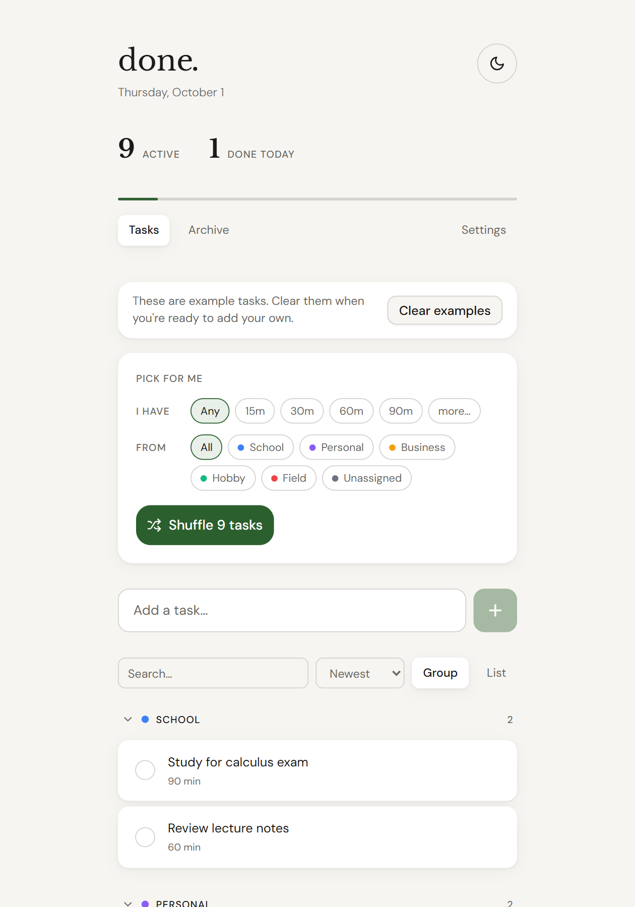
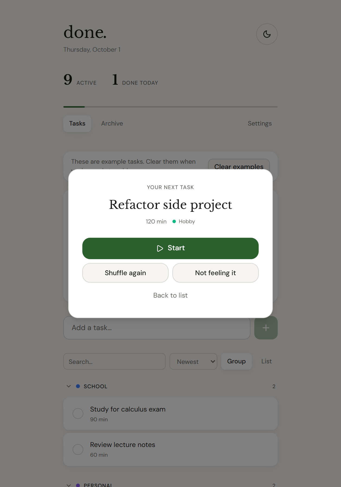
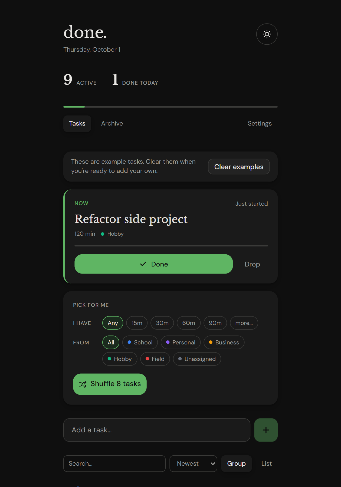
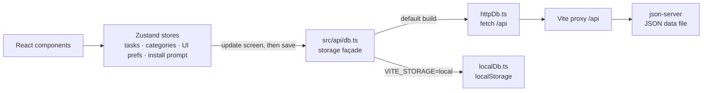

# Task Shuffler

A task manager built on one idea: the hard part isn't tracking tasks, it's picking one. Tell it how much time you have, and it picks a task for you.

Task Shuffler is the name of the repo and the portfolio project; inside the app, it calls itself **done.**

You keep a list of tasks, each with a rough length and a category. When a free half hour turns up, you say how long you have and which areas to draw from, and it chooses one for you, so the time goes to doing the task instead of deciding. It is a single-user tool that runs entirely in the browser (localStorage), or against a small JSON REST backend if you want one list shared between devices.

**Live demo:** [www.adriangaona.dev/demos/tasklists](https://www.adriangaona.dev/demos/tasklists/) (the browser-only build, preloaded with example tasks) · [Project page](https://www.adriangaona.dev/work/task-shuffler)

| Pick for me | The pick | Now, in the dark theme |
| --- | --- | --- |
|  |  |  |

*Screenshots are from the browser-only build of this code, with the built-in example tasks.*

## Contents

- [Features](#features)
- [How it works](#how-it-works)
- [Engineering highlights](#engineering-highlights)
- [Getting started](#getting-started)
- [Configuration](#configuration)
- [Tests](#tests)
- [Limitations](#limitations)
- [License](#license)
- [Author](#author)

## Features

- **Pick for me.** Say how much time you have (any, 15, 30, 60 or 90 minutes, or at least / between / exactly N) and which categories to draw from. The button shows how many tasks fit; if none do, it suggests the smallest change that works ("Try 30 min").
- **Weighted shuffle.** A short reel lands on one task. Tasks that have waited longer come up more often (up to 3× after 30 days). Shuffle again, or skip with "Not feeling it".
- **Start, then Now.** The started task is pinned above the picker with elapsed time against its estimate. Done archives it (with Undo); Drop returns it to the pool.
- **Quick add and shortcuts.** Typing `Call mom 15m #personal` sets the length and category (`1h`, `1h30` and `45 min` work too). Shortcuts: `N` new task, `S` shuffle, `/` search, `Enter` start, `Esc` close.
- **Categories.** Six colour-coded defaults; add, rename, recolour, reorder or hide them. Deleting a custom one moves its tasks to Unassigned.
- **Today and Archive.** The header counts active tasks and tasks done today. The archive groups finished tasks as Today, This week and Earlier, with restore and delete.
- **Backup.** Export everything as JSON. Import validates the file and asks before replacing anything.
- **Browser-only mode.** Starts empty, or with example tasks on `?demo` or when embedded. It asks for persistent storage, suggests installing the app (production builds ship a web manifest and a network-first service worker), and reminds you to download a backup.

Light, dark and system themes are built in, and on phones the pick card opens as a bottom sheet.

## How it works



The components read from Zustand stores (tasks, categories, UI preferences and the browser's install prompt). The task and category stores update the screen first and then save through a storage façade. Which backend the façade uses is decided at build time:

| Build | Storage | Good for |
| --- | --- | --- |
| default | [json-server](https://github.com/typicode/json-server) over HTTP. The browser calls `/api` on the UI's own origin, and Vite proxies it to json-server, which runs with CORS off behind a same-origin guard. | One list shared by every device that can reach the UI (dev server or Docker). |
| `VITE_STORAGE=local` | The browser's localStorage, seeded with the six default categories (plus the example tasks on `?demo` or in an iframe). | A static build with no server. This is the build the portfolio embeds. |

The rules that matter (shuffle weighting, time filters, the quick-add parser, backup validation and reminder timing) are pure functions in `src/utils/` and `src/lib/safety.ts`, so they are tested without a browser. The stores are tested against an in-memory fake of the façade whose calls can be made to fail ([`src/test/fakeApi.ts`](src/test/fakeApi.ts)).

### Tech stack and why

- **React 19, TypeScript (strict) and Vite 6.** Vite also provides the `/api` proxy, so the browser only needs one origin and one port.
- **Zustand 5.** Small stores without providers. Only UI preferences (theme, sort, view, last picker choice) are kept with its `persist` middleware; task data always goes through the façade.
- **json-server 0.17** as the default backend. It gives a REST API over a JSON file with no backend code, which is enough for a single-user tool on your own machine or network.
- **Tailwind CSS 4 and shadcn/ui (Radix)** for the dialog, buttons and toasts (sonner). The visual system lives in CSS variables in `src/index.css`.
- **framer-motion** for the shuffle reel and the shared-layout transition that grows the winning name into the result card. It ships in a lazy chunk with the dialogs ([`src/components/lazyViews.tsx`](src/components/lazyViews.tsx)), which takes about a third off the main JavaScript chunk. The chunks are preloaded right after startup, so dialogs still open instantly and the service worker can cache them. Also used: date-fns, uuid and lucide-react.
- **Vitest, Testing Library, ESLint and Prettier** (typescript-eslint with type-aware rules, plus the React hooks rules). Tests run in Node; the component test uses jsdom.

### Project structure

```text
.
├── .github/workflows/ci.yml   # lint, type-check, test and both builds, on Node 20 and 22
├── public/                    # web manifest, service worker (sw.js), icons
├── scripts/
│   ├── dev.mjs                # npm run dev / npm run server: json-server (+ Vite) on a private data copy
│   ├── api-guard.cjs          # same-origin guard for json-server and the /api proxy (+ tests)
│   ├── docker-start.sh        # container start: adopt the data volume, seed it, run as the node user
│   └── docker-smoke.sh        # CI: build the image, save through it, check reloads and keep-alive
├── src/
│   ├── api/                   # db.ts façade, httpDb.ts (json-server), localDb.ts (localStorage)
│   ├── adapters/              # localStorage read/write used by localDb.ts
│   ├── store/                 # Zustand stores, persist.ts + pendingWrites.ts (save, rollback), loadAll.ts, replaceAllData.ts (+ tests)
│   ├── utils/                 # shuffle, filters, quickAdd, exportImport, archive (+ tests)
│   ├── lib/                   # safety.ts (backup / install rules, + tests), platform.ts, utils.ts
│   ├── data/                  # default categories, example tasks (+ tests)
│   ├── hooks/                 # useShortcuts.ts, useTheme.ts
│   ├── components/            # activities, categories, shuffle, onboarding, layout, ui (shadcn/ui), lazyViews.tsx
│   ├── test/fakeApi.ts        # in-memory backend for the store and component tests
│   ├── types/index.ts
│   └── App.tsx (+ App.test.tsx) · main.tsx · index.css
├── db.json                    # seed data for server mode (generic sample tasks)
├── index.html
├── Dockerfile · docker-compose.yml
└── vite.config.ts · tsconfig.json · eslint.config.js · .prettierrc.json
```

## Engineering highlights

- **The backend is chosen at build time.** [`src/api/db.ts`](src/api/db.ts) puts two implementations behind one async API and picks one from `import.meta.env.VITE_STORAGE`. Vite inlines the flag, so the static build ships without the HTTP client.
- **Optimistic updates that unwind correctly.** The stores update the screen, then save. [`src/store/pendingWrites.ts`](src/store/pendingWrites.ts) keeps, per task and field, the value the server is known to hold and the saves still in flight. When one finishes, the field shows the newest save still pending, or the server's value once none are left. So overlapping changes (start then drop, rename twice, complete then Undo) end up matching the server whichever saves fail and in whatever order they finish, given that the server answers in the order it applies them, as json-server does. One "Couldn't save that change" toast covers any number of failures. [`src/store/overlappingSaves.test.ts`](src/store/overlappingSaves.test.ts) replays each overlapping sequence, for tasks and categories, in every finishing order with every mix of success and failure.
- **Failures are visible.** `fetch` only rejects on network failure, so [`src/api/httpDb.ts`](src/api/httpDb.ts) throws on any non-2xx response, and a 404 or 500 triggers the same rollback. If the lists can't be loaded at startup, [`src/store/loadAll.ts`](src/store/loadAll.ts) records why, and the app shows an error with a retry instead of an empty list. Importing a backup writes every incoming item before deleting leftovers, so a failure part-way can leave extra old items behind but never deletes anything before the new data is written.
- **Shuffle logic that can be tested.** [`src/utils/shuffle.ts`](src/utils/shuffle.ts) weights each task linearly from 1 to 3 over 30 days. When nothing fits, it searches the time presets for the smallest change that would. Tests inject `random` and `now`, so the 3× claim is checked, not assumed.
- **Accessibility and strictness.** The pick card is a Radix dialog ([`PickDialog.tsx`](src/components/shuffle/PickDialog.tsx)) with a focus trap and Escape to close. Chips use `aria-pressed`, the progress bars have `progressbar` roles, and focus rings use `:focus-visible`. With the OS reduced-motion setting on, the shuffle skips the reel, CSS animations and transitions drop to near zero, and scrolling jumps instead of gliding. TypeScript runs in strict mode with `noUnusedLocals` and `noUnusedParameters`, and ESLint's type-aware rules reject unhandled promises.

## Getting started

**Prerequisites:** Node.js 20.19+ or 22.13+ (the minimum for ESLint 10), with npm. Docker is optional.

### Quick start (server mode)

```bash
git clone https://github.com/jadrianlg16/task-shuffler.git && cd task-shuffler
npm ci
npm run dev
```

This serves the UI at http://localhost:3003 and runs json-server on port 3001 behind `/api`. On first run, `scripts/dev.mjs` copies `db.json` to the git-ignored `data/dev-db.json` and serves that copy, so the tracked seed never changes. Delete `data/` to start over. `npm run server` starts json-server on its own.

### Browser-only build (no server)

```bash
VITE_STORAGE=local npm run build
npm run preview
```

Open http://localhost:4173. It starts empty; add `?demo` to the URL on a first visit to load the example tasks. `dist/` is plain static files. In PowerShell, set the variable first: `$env:VITE_STORAGE="local"; npm run build`.

### Docker

```bash
docker build -t task-shuffler .
docker run --rm -p 127.0.0.1:3003:3003 -v task-shuffler-data:/app/data task-shuffler
```

The image is a development container, not a production build. It installs with `npm ci`, and [`scripts/docker-start.sh`](scripts/docker-start.sh) starts json-server and the Vite dev server as the unprivileged `node` user; only port 3003 needs publishing. Tasks live in `/app/data/db.json`, which is seeded from `db.json` on first start, so the named volume keeps them when the container is re-created. The script starts as root only to hand the volume to `node`, so a volume written by an earlier image (which ran as root) keeps working. The command above and `docker-compose.yml` publish the port on 127.0.0.1 only, because the API has no authentication; publish it on a LAN address only on a network you trust. For hot reload against your working copy, run `docker compose up`; it bind-mounts the source and keeps the data in a named volume.

## Configuration

All variables are optional.

| Variable | Default | Purpose |
| --- | --- | --- |
| `VITE_STORAGE` | unset (server mode) | Read by Vite at build or dev start. Set it to `local` for the localStorage build. |
| `VITE_API_URL` | `/api` | Read by Vite at build or dev start (server mode). The API base URL the browser calls. |
| `API_PROXY_TARGET` | `http://localhost:3001` | Where the Vite dev and preview servers forward `/api`. `npm run dev` derives it from `API_PORT`, and the Docker image sets `http://127.0.0.1:3001`. |
| `PORT` | `3003` | UI port for `npm run dev`. |
| `API_PORT` | `3001` | json-server port for `npm run dev` and `npm run server`. |
| `DB_FILE` | `data/dev-db.json` (Docker: `/app/data/db.json`) | json-server's live data file. It is seeded from `db.json` if missing. json-server doesn't watch it, so restart it after editing the file by hand. |

## Tests

```bash
npm test              # Vitest, single run
npm run lint          # ESLint; warnings fail it too
npm run format:check  # Prettier (npm run format rewrites the files)
npx tsc -b            # type-check (npm run build runs this first as well)
```

The unit tests cover the pure logic: shuffle weighting, candidate filtering and the "nothing fits" suggestion; the quick-add parser; backup validation; the install and backup reminder rules; the example tasks; and archive grouping. The store tests run against [`src/test/fakeApi.ts`](src/test/fakeApi.ts): loading (and failing to load), optimistic add, update and delete with their rollbacks, start and drop, category changes, and backup import. [`src/App.test.tsx`](src/App.test.tsx) renders the whole app in jsdom to shuffle, skip a pick, start a task, and recover from a failed startup load. [`scripts/api-guard.test.mjs`](scripts/api-guard.test.mjs) covers the same-origin guard. The two storage backends themselves (`httpDb.ts`, `localDb.ts`) have no unit tests.

The [CI workflow](.github/workflows/ci.yml) runs `npm ci`, the four commands above and both builds (`npm run build`, and again with `VITE_STORAGE=local`) on Node 20 and 22, for pushes to `main` and for pull requests. A second job runs [`scripts/docker-smoke.sh`](scripts/docker-smoke.sh), which builds the image, saves through it and fails if a save makes the dev server reload the page or if the `/api` proxy closes every connection. It has not run on GitHub yet; every step has been run locally, on Windows and in Linux containers. The one formatting-only commit is listed in `.git-blame-ignore-revs`.

## Limitations

- **No accounts and no authentication.** Web pages from other origins can't use the API: json-server runs with CORS off, and [`scripts/api-guard.cjs`](scripts/api-guard.cjs) refuses foreign `Origin` headers, cross-site fetches and JSONP, in front of both json-server and the `/api` proxy. Anything that can reach the UI port directly (curl, a script) can still read and change the list, so run server mode on your own machine or a trusted network. json-server is a development tool, not a hardened backend.
- **No production server image.** The Dockerfile runs the Vite dev server. For hosting, use the browser-only build (static files).
- **Browser-only data lives in one browser on one device.** It does not sync, and browsers can evict site data. The app requests persistent storage and nudges you to install and back up, but it cannot guarantee the data survives.
- **Server mode doesn't sync live.** The lists load once, at startup (with an error and a retry if json-server can't be reached), and changes made while it is down are rolled back with a toast. The app doesn't poll, so edits from another device appear only after a reload.
- **Imports in server mode are not atomic,** because json-server has no transactions. If an import fails part-way, the app reloads what the server holds and says so, and some old items may remain.
- **The app itself has no analytics and sets no cookies.** Its only third-party requests are for Google Fonts.
- **The hosted demo is built from this repo by the portfolio site's build script,** so between portfolio deploys it can trail `main`.

## License

Copyright © 2026 Adrián Gaona. All rights reserved. The source is public so it can be read and evaluated; no license is granted to reuse or redistribute it.

Third-party packages keep their own licenses (mostly MIT). The Libre Baskerville and DM Sans fonts are loaded from Google Fonts under the SIL Open Font License.

## Author

**Adrián Gaona** · [adriangaona.dev](https://www.adriangaona.dev) · [LinkedIn](https://www.linkedin.com/in/jesus-lopez-95762b2b6) · [GitHub](https://github.com/jadrianlg16)
