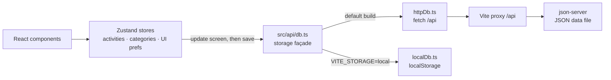

# Task Shuffler

A task manager built on one idea: the hard part isn't tracking tasks, it's picking one. Tell it how much time you have, and it picks a task for you.

Task Shuffler is the name of the repo and the portfolio project; inside the app, it calls itself **done.**

You keep a list of tasks, each with a rough length and a category. When a free half hour turns up, you say how long you have and which areas to draw from, and it chooses one for you, so the time goes to doing the task instead of deciding. It is a single-user tool that runs entirely in the browser (localStorage), or against a small JSON REST backend if you want one list shared between devices.

**Live demo:** [www.adriangaona.dev/demos/tasklists](https://www.adriangaona.dev/demos/tasklists/) (the browser-only build, preloaded with example tasks) · [Project page](https://www.adriangaona.dev/work/task-shuffler)

| Pick for me | The pick | Now, in the dark theme |
| --- | --- | --- |
|  |  |  |

*Screenshots are from the browser-only build of this code, with the built-in example tasks.*

## Contents

- [Features](#features)
- [How it works](#how-it-works)
- [Engineering highlights](#engineering-highlights)
- [Getting started](#getting-started)
- [Configuration](#configuration)
- [Tests](#tests)
- [Limitations](#limitations)
- [License](#license)
- [Author](#author)

## Features

- **Pick for me.** Choose how much time you have (any, 15, 30, 60 or 90 minutes; or at least, between or exactly under "more…") and which categories to draw from (none picked means all). The button shows how many tasks fit. If none do, it offers the smallest change that works, such as "Try 30 min". Your last choice is remembered.
- **Weighted shuffle.** A short reel lands on one task. Older tasks come up more often (up to 3× for a task that has waited 30 days or more), so nothing sits forever. You can shuffle again, or skip a task with "Not feeling it"; skipped tasks stay out until you close the card.
- **Start, then Now.** Starting a task pins it above the picker, showing how long you've been at it against its estimate. Done archives it (with Undo), and Drop puts it back in the pool.
- **Quick add with shorthand.** Type `Call mom 15m #personal` and press Enter. It also understands `1h`, `1h30` and `45 min`. `#tags` match category names, and unknown tags stay in the name. Or set them with the minute chips and category picker that appear while you add a task.
- **Categories.** There are six colour-coded defaults. You can add, rename, recolour, reorder and hide categories, and delete the ones you added; deleting a category moves its tasks to Unassigned.
- **Today at a glance.** The header shows the number of active tasks, the number done today, and a bar that fills as today's work gets done.
- **Archive.** Completed tasks are listed newest first, grouped as Today, This week and Earlier. You can restore them or delete them for good.
- **Backup.** Settings exports everything as JSON. Import validates the file first, then asks before replacing anything and offers to download the current data first.
- **Keyboard shortcuts.** `N` new task, `S` shuffle, `/` search, `Enter` start the picked task, `Esc` close.
- **First run.** The browser build starts empty, with a "Try it with example tasks" button. Embedded in an iframe, or opened with `?demo`, it starts with the examples. A banner clears them without touching your own tasks.
- **Keeping browser-only data.** The browser build asks for persistent storage and suggests installing the app (Add to Home Screen on iPhone, where Safari can clear a site's data after 7 days without a visit). It also reminds you to download a backup after a week of use, then monthly.
- **Installable.** Production builds ship a web manifest and a network-first service worker. Requests under `/api` are never cached, and the worker is not registered inside an iframe.
- **Themes and phones.** Light, dark and system themes. On small screens the pick card opens as a bottom sheet, and the layout respects safe-area insets.

## How it works



The components read from three Zustand stores. The stores update the screen first and then save through a storage façade. Which backend the façade uses is decided at build time:

| Build | Storage | Good for |
| --- | --- | --- |
| default | [json-server](https://github.com/typicode/json-server) over HTTP. The browser calls `/api` on the UI's own origin, and Vite proxies it to json-server. | One list shared by every device that can reach the UI (dev server or Docker). |
| `VITE_STORAGE=local` | The browser's localStorage, seeded with the six default categories (plus the example tasks on `?demo` or in an iframe). | A static build with no server. This is the build the portfolio embeds. |

The rules that matter (shuffle weighting, time filters, the quick-add parser, backup validation and reminder timing) are pure functions in `src/utils/` and `src/lib/safety.ts`, so they are tested without a browser.

### Tech stack and why

- **React 19, TypeScript (strict) and Vite 6.** Vite also provides the `/api` proxy, so the browser only needs one origin and one port.
- **Zustand 5.** Small stores without providers. Only UI preferences (theme, sort, view, last picker choice) are kept with its `persist` middleware; task data always goes through the façade.
- **json-server 0.17** as the default backend. It gives a REST API over a JSON file with no backend code, which is enough for a single-user tool on your own machine or network.
- **Tailwind CSS 4 and shadcn/ui (Radix)** for the dialog, buttons and toasts (sonner). The visual system lives in CSS variables in `src/index.css`.
- **framer-motion** for the shuffle reel and the shared-layout transition that grows the winning name into the result card. Also used: date-fns, uuid and lucide-react.

### Project structure

```text
.
├── public/                 # web manifest, service worker (sw.js), icons
├── scripts/dev.mjs         # npm run dev / npm run server: json-server (+ Vite) on a private data copy
├── src/
│   ├── api/                # db.ts façade, httpDb.ts (json-server), localDb.ts (localStorage)
│   ├── adapters/           # localStorage read/write used by localDb.ts
│   ├── store/              # Zustand stores, persist.ts (save + rollback), replaceAllData.ts (import)
│   ├── utils/              # shuffle, filters, quickAdd, exportImport, archive (+ tests)
│   ├── lib/                # safety.ts (backup / install rules, + tests), platform.ts, utils.ts
│   ├── data/               # default categories, example tasks (+ tests)
│   ├── hooks/              # useShortcuts.ts, useTheme.ts
│   ├── components/         # activities, categories, shuffle, onboarding, layout, ui (shadcn/ui)
│   ├── types/index.ts
│   ├── App.tsx · main.tsx · index.css
├── db.json                 # seed data for server mode (generic sample tasks)
├── index.html
├── Dockerfile · docker-compose.yml
└── vite.config.ts · tsconfig.json
```

## Engineering highlights

- **The backend is chosen at build time.** [`src/api/db.ts`](src/api/db.ts) puts two implementations behind one async API and picks one from `import.meta.env.VITE_STORAGE`. Vite inlines the flag, so the static build ships without the HTTP client.
- **Optimistic updates with a targeted rollback.** The stores snapshot only the items a change touches, update the screen, then save. [`src/store/persist.ts`](src/store/persist.ts) restores just the change that failed and shows a single "Couldn't save that change" toast, so the screen never shows data that wasn't stored.
- **HTTP errors are errors.** `fetch` only rejects on network failure, so [`src/api/httpDb.ts`](src/api/httpDb.ts) throws on any non-2xx response, and a 404 or 500 triggers the same rollback. Importing a backup writes every incoming item before deleting leftovers, so a failure part-way can leave extra old items behind but never deletes anything before the new data is written.
- **Shuffle logic that can be tested.** [`src/utils/shuffle.ts`](src/utils/shuffle.ts) weights each task linearly from 1 to 3 over 30 days. When nothing fits, it searches the time presets for the smallest change that would. Tests inject `random` and `now`, so the 3× claim is checked, not assumed.
- **Accessibility and strictness.** The pick card is a Radix dialog ([`PickDialog.tsx`](src/components/shuffle/PickDialog.tsx)) with a focus trap and Escape to close. Chips use `aria-pressed`, the progress bars have `progressbar` roles, and focus rings use `:focus-visible`. The framer-motion animations follow the OS reduced-motion setting, so reduced-motion users skip the reel; the small CSS entrance animations don't yet. TypeScript runs in strict mode with `noUnusedLocals` and `noUnusedParameters`, and most modules are under 150 lines.

## Getting started

**Prerequisites:** Node.js 20.17+ or 22.9+, with npm. Older Node 20 releases work but print an engine warning. Docker is optional.

### Quick start (server mode)

```bash
git clone https://github.com/jadrianlg16/task-shuffler.git && cd task-shuffler
npm ci
npm run dev
```

This opens the UI at http://localhost:3003 and runs json-server on port 3001 behind `/api`. On first run, `scripts/dev.mjs` copies `db.json` to the git-ignored `data/dev-db.json` and serves that copy, so the tracked seed never changes. Delete `data/` to start over. `npm run server` starts json-server on its own.

### Browser-only build (no server)

```bash
VITE_STORAGE=local npm run build
npm run preview
```

Open http://localhost:4173. It starts empty; add `?demo` to the URL on a first visit to load the example tasks. `dist/` is plain static files. In PowerShell, set the variable first: `$env:VITE_STORAGE="local"; npm run build`.

### Docker

```bash
docker build -t task-shuffler .
docker run --rm -p 3003:3003 -v task-shuffler-data:/app/data task-shuffler
```

The image is a development container, not a production build. It runs `npm install`, then starts json-server and the Vite dev server inside the container, and only port 3003 needs publishing. Tasks live in `/app/data/db.json`, which is seeded from `db.json` on first start, so the named volume keeps them when the container is re-created. For hot reload against your working copy, run `docker compose up`; it bind-mounts the source and keeps the data in a named volume.

## Configuration

All variables are optional.

| Variable | Default | Purpose |
| --- | --- | --- |
| `VITE_STORAGE` | unset (server mode) | Read by Vite at build or dev start. Set it to `local` for the localStorage build. |
| `VITE_API_URL` | `/api` | Read by Vite at build or dev start (server mode). The API base URL the browser calls. |
| `API_PROXY_TARGET` | `http://localhost:3001` | Where the Vite dev and preview servers forward `/api`. `npm run dev` derives it from `API_PORT`, and the Docker image sets `http://127.0.0.1:3001`. |
| `PORT` | `3003` | UI port for `npm run dev`. |
| `API_PORT` | `3001` | json-server port for `npm run dev` and `npm run server`. |
| `DB_FILE` | `data/dev-db.json` (Docker: `/app/data/db.json`) | json-server's live data file. It is seeded from `db.json` if missing. |

## Tests

```bash
npm test
```

Vitest runs once over the pure logic: shuffle weighting, candidate filtering and the "nothing fits" suggestion; the quick-add parser; backup validation; the install and backup reminder rules; the example tasks; and archive grouping. The stores, the storage backends and the React components have no automated tests. `npm run build` type-checks the whole project with `tsc -b` before bundling.

## Limitations

- **No accounts and no authentication.** Anyone who can reach the UI port can read and change the list, so run server mode on your own machine or a trusted network. json-server is a development tool, not a hardened backend.
- **No production server image.** The Dockerfile runs the Vite dev server. For hosting, use the browser-only build (static files).
- **Browser-only data lives in one browser on one device.** It does not sync, and browsers can evict site data. The app requests persistent storage and nudges you to install and back up, but it cannot guarantee the data survives.
- **Server mode loads the list once.** If json-server isn't reachable when the page opens, the list looks empty, with no error message, until you reload. Changes made while it is down are rolled back with a toast. The app doesn't poll, so edits from another device appear only after a reload.
- **Imports in server mode are not atomic,** because json-server has no transactions. If an import fails part-way, the app reloads what the server holds and says so, and some old items may remain.
- **One JavaScript bundle** of about 500 kB (about 158 kB gzipped). There is no code splitting yet, and Vite prints a chunk-size warning.
- **Fonts load from Google Fonts.** There are no analytics, no cookies and no other third-party requests.
- **The portfolio demo is built and deployed separately** from this repo, so it can lag behind `main`.

## License

Copyright © 2026 Adrián Gaona. All rights reserved. The source is public so it can be read and evaluated; no license is granted to reuse or redistribute it.

Third-party packages keep their own licenses (mostly MIT). The Libre Baskerville and DM Sans fonts are loaded from Google Fonts under the SIL Open Font License.

## Author

**Adrián Gaona** · [adriangaona.dev](https://www.adriangaona.dev) · [LinkedIn](https://www.linkedin.com/in/jesus-lopez-95762b2b6) · [GitHub](https://github.com/jadrianlg16)
